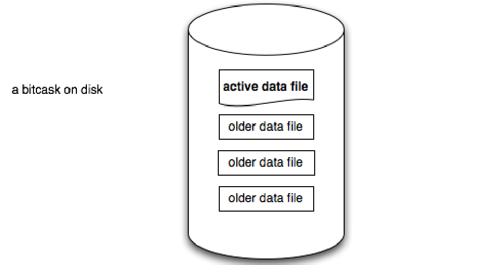

# kvs

一个简单的 KV 数据库, 使用简化版 `Bitcask` 算法持久化储存kv数据.

## Motivation

To complete the project exercise of [talent-plan's TP201][talent-plan's TP201].

## Features

- [x] Implement a Bitcask-like engine(a Log-structured File Storage)
- [x] Client-Server Networking
- [x] Concurrency: lock-free readers
- [ ] Asynchronous
- [ ] Benchmark

## Useage

`rskv`分为server与client:

``` bash
USAGE:
    kvs-client <SUBCOMMAND>

OPTIONS:
    -h, --help       Print help information
    -V, --version    Print version information

SUBCOMMANDS:
    get     Get the string value of a given string key
    help    Print this message or the help of the given subcommand(s)
    rm      Remove a given key
    set     Set the value of a string key to a string
```

``` bash
USAGE:
    kvs-server [OPTIONS]

OPTIONS:
        --addr <ADDR>        Server listening address, default is 127.0.0.1:4000
        --engine <ENGINE>    Engine type, default is kvs
    -h, --help               Print help information
    -V, --version            Print version information
```

## 学习心得

### Bitcask(单线程)

`rskv` 默认使用类似 [Bitcask] 的算法来实现储存引擎, 但也可以使用其他存储引擎(只需要实现 `KvsEngine` trait).

`Bitcask` 的数据储存在磁盘的一个目录里面。目录中有多个文件(log file)，其中有旧数据文件和活跃的数据文件，但是同时只有一个活跃的文件用于写入新的数据。

另外每次写入新的数据都是以追加的方式写入到当前活跃文件的末尾。



`rskv` 储存在磁盘的数据的格式是rust enum的json序列化数据,这些数据被称为 `command`,其在rust code中的定义如下：

``` rust
#[derive(Debug, Serialize, Deserialize)]
enum Cmd {
    Set { key: String, value: String },
    Rm { key: String },
}
```

通过 `Cmd`的定义我们可以看出来无论是设置键值对，还是删除操作都会以追加的方式写入活跃文件，也就是说不会以实际的方式删除或者替换掉旧的数据。

当然如果我们不断的set和rm key/value pair, 数据的大小会不断增加。因此我们需要设置一个阈值，当这些无用数据的大小超过该阈值时，存储引擎就会重新遍历一遍所有的 log files, 加载有效数据到内存，清除掉旧的文件数据，并创建一个新的文件并写入这些有效数据。

下面是 `rskv` 实现`Bitcask`的一些API接口：

``` rust
Bitcask
// 初始化 Bitcask 储存引擎: 建立索引，计算无效数据的长度,
// 为每一个log file创建reader, 为当前的活跃文件创建 writer
pub fn open(path: impl Into<PathBuf>) -> Result<Self>

// 设置 key value
pub fn set(&mut self, key: String, value: String) -> Result<()>

// 根据 key 获取 value
pub fn get(&mut self, key: String) -> Result<Option<String>>

// 删除 key
pub fn rm(&mut self, key: String) -> Result<()>

// 私有方法, 清除无效的 `command`s
fn compact(&mut self) -> Result<()>

// Bitcask除了将数据存储在磁盘还在server运行期间，还在内存维护了一个从key到`CmdPos`索引,
// 这样就可以通过索引快速找到 key 对应的 磁盘上 `command` 数据的位置
fn index(fid: u64, 
reader: &mut BufReaderWithPos<File>, 
index: &mut BTreeMap<String, CmdPos>) -> Result<u64>
```

`Bitcask`的结构体定义:

``` rust
pub struct Bitcask {
    /// Directory for sotring log data, it contains many log file
    data_path: PathBuf,
    /// [Bitcask] build caches to quickly find reader belongs to `fid` using `HashMap`.
    ///
    /// This hashmap insert all exsiting log files when [Bitcask]::open is called.
    readers: HashMap<u64, BufReaderWithPos<File>>,
    /// Current writer to write `command`s into disk
    cur_writer: BufWriterWithPos<File>,
    /// log file id which the current writer write to
    cur_fid: u64,
    /// In-memory Index maps from keys(String) to [CmdPos].
    ///
    /// This is a `B-Tree` which would load `log files` in the disk into memory when [Bitcask]::open is called.
    index: BTreeMap<String, CmdPos>,
    /// The number of bytes representing "stale" commands that could be
    /// deleted during a compaction.
    uncompacted: u64,
}
```

`CmdPos`的结构体定义:

``` rust
#[derive(Debug, Clone)]
/// In-memory representation of a `command`.
///
/// Indicates where we can find it.
pub struct CmdPos {
    /// which file this commmand belong to
    fid: u64,
    /// start position of command
    pos: u64,
    /// length of command
    len: u64,
}
```

[talent-plan's TP201]: https://github.com/pingcap/talent-plan/blob/master/courses/rust/README.md
[Bitcask]: https://riak.com/assets/bitcask-intro.pdf

### Concurrency

`risk` 支持多个线程并发读写磁盘，为了保证并发的高效性，其中写流程是lock-free，而读流程为了保证线程安全因而必须是串行的，就是说在读的时候需要`Mutex`的保护。(写流程并不是真正的并行，因为底层文件读取一定是串行的)

为了加入并发的支持, 我们需要

1. 使用线程池来管理不同tcp链接的读写
2. 改变 `Bitcask`的结构体定义使其能被多线程共享
